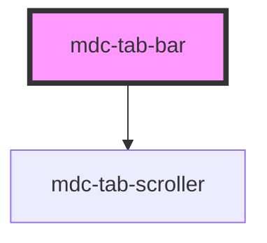

# my-component

<!-- Auto Generated Below -->

## Properties

| Property       | Attribute       | Description                         | Type      | Default |
| -------------- | --------------- | ----------------------------------- | --------- | ------- |
| `bottomBorder` | `bottom-border` | Should a bottom border be displayed | `boolean` | `true`  |

## Dependencies

### Depends on

- [mdc-tab-scroller](..\tab-scroller)

### Graph

----------------------------------------------

*Built with [StencilJS](https://stenciljs.com/)*
