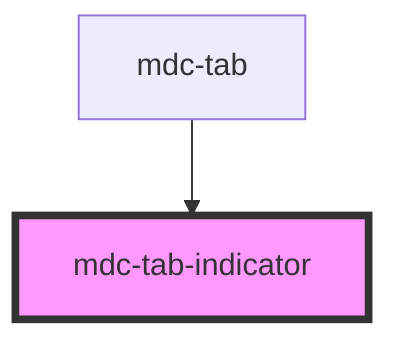

# my-component

<!-- Auto Generated Below -->

## Properties

| Property   | Attribute   | Description                      | Type      | Default |
| ---------- | ----------- | -------------------------------- | --------- | ------- |
| `isActive` | `is-active` | Visually activates the indicator | `boolean` | `false` |

## Dependencies

### Used by

 - [mdc-tab](..\tab)

### Graph

----------------------------------------------

*Built with [StencilJS](https://stenciljs.com/)*
