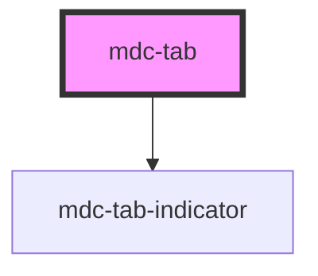

# my-component

<!-- Auto Generated Below -->

## Properties

| Property   | Attribute  | Description                      | Type      | Default     |
| ---------- | ---------- | -------------------------------- | --------- | ----------- |
| `icon`     | `icon`     | The icon                         | `string`  | `undefined` |
| `label`    | `label`    | The label                        | `string`  | `undefined` |
| `selected` | `selected` | Visually activates the indicator | `boolean` | `false`     |

## Dependencies

### Depends on

- [mdc-tab-indicator](..\tab-indicator)

### Graph

----------------------------------------------

*Built with [StencilJS](https://stenciljs.com/)*
